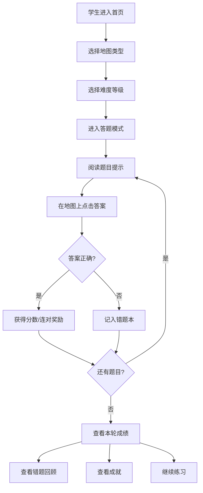
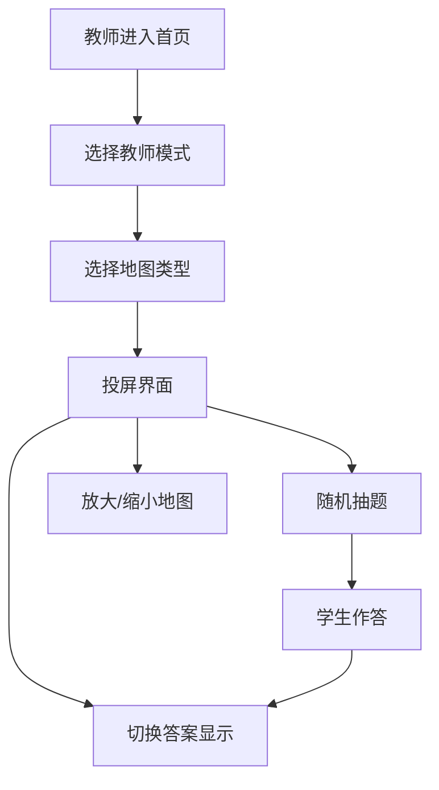

# 地理学习小游戏 PRD

## 1. 产品概述

面向小学高年级学生的纯前端地理学习小游戏，通过互动式地图答题帮助学生掌握地理方位和地图识读技能。产品融合游戏化激励机制和教师辅助工具，让地理学习变得生动有趣。

- **目标用户**：小学高年级学生（4-6年级）、地理教师
- **核心价值**：游戏化学习、多场景地图练习、即时反馈、错题巩固

## 2. 核心功能

### 2.1 用户角色

| 角色 | 使用方式 | 核心功能 |
|------|----------|----------|
| 学生 | 自主学习 | 关卡选择、地图答题、错题回顾、成就系统 |
| 教师 | 课堂教学 | 投屏模式、隐藏答案、随机抽题、地图放大 |

### 2.2 功能模块

1. **关卡选择页**：地图类型选择、难度选择、开始游戏
2. **地图答题页**：互动地图、题目提示、倒计时、连对奖励、提示功能
3. **错题回顾页**：错题列表、错误位置标记、正确解释
4. **成就系统页**：速度成就、准确率成就、连续练习天数
5. **教师投屏页**：隐藏答案、地图放大、随机抽题

### 2.3 页面详情

| 页面名称 | 模块名称 | 功能描述 |
|-----------|-------------|---------------------|
| 关卡选择页 | 地图类型卡片 | 中国地图、世界大洲、经纬度网格、校园平面图四种类型卡片 |
| 关卡选择页 | 难度选择 | 简单/中等/困难三档难度 |
| 关卡选择页 | 快速开始 | 一键进入游戏 |
| 地图答题页 | 互动地图区 | 可点击的 SVG 地图，显示省份/城市/河流等 |
| 地图答题页 | 题目区 | 文字提示、当前题号、倒计时 |
| 地图答题页 | 奖励区 | 连对次数、分数、提示按钮 |
| 地图答题页 | 反馈区 | 答题正确/错误动画反馈 |
| 错题回顾页 | 错题列表 | 按地图类型分类的错题卡片 |
| 错题回顾页 | 错题详情 | 错误位置高亮、正确答案、知识点解释 |
| 成就系统页 | 成就徽章 | 速度之星、准确率大师、坚持达人等徽章 |
| 成就系统页 | 学习统计 | 总答题数、正确率、平均答题速度 |
| 成就系统页 | 连续打卡 | 连续练习天数显示、日历热力图 |
| 教师投屏页 | 投屏控制 | 隐藏/显示答案切换、地图缩放 |
| 教师投屏页 | 随机抽题 | 随机从题库抽取题目展示 |
| 教师投屏页 | 大屏模式 | 优化的大屏显示布局 |

## 3. 核心流程

### 3.1 学生学习流程

学生进入应用，选择地图类型和难度，进入答题模式。系统展示题目，学生在地图上点击答案。答对获得分数和连对奖励，答错记入错题本。完成后查看成绩和错题，可继续练习或查看成就。

### 3.2 教师投屏流程

教师选择投屏模式，可随机抽题展示在大屏上，控制答案的显示/隐藏，放大地图便于课堂讲解。

## 4. 用户界面设计

### 4.1 设计风格

- **主色调**：清新明亮的天蓝色 (#4ECDC4) + 活力橙色 (#FF6B6B)
- **辅助色**：浅绿 (#95E1D3)、鹅黄 (#FCE38A)、淡紫 (#DDA0DD)
- **背景色**：渐变的淡蓝色天空感背景
- **按钮风格**：圆润大按钮，带微立体阴影和点击动效
- **字体**：圆润可爱的无衬线字体，标题稍大加粗
- **布局风格**：卡片式布局，圆角大，留白适中
- **图标风格**：卡通风格 emoji + 简约线性图标
- **整体基调**：活泼、童趣、游戏化、鼓励式

### 4.2 页面设计概览

| 页面名称 | 模块名称 | UI 元素 |
|-----------|-------------|-------------|
| 关卡选择页 | 顶部导航 | 游戏标题、成就入口、错题本入口 |
| 关卡选择页 | 地图卡片网格 | 4 个大卡片，带地图缩略图和标题，悬停放大动效 |
| 关卡选择页 | 难度选择器 | 3 个圆形按钮，选中态有颜色填充 |
| 关卡选择页 | 开始按钮 | 大尺寸渐变按钮，脉冲动画吸引点击 |
| 地图答题页 | 顶部状态栏 | 倒计时、分数、连对次数、提示按钮 |
| 地图答题页 | 中间地图区 | 大尺寸 SVG 地图，可点击区域高亮 |
| 地图答题页 | 底部题目区 | 卡通气泡式题目文字 |
| 地图答题页 | 反馈动效 | 答对烟花/彩带，答错轻微抖动 |
| 错题回顾页 | 分类标签 | 按地图类型切换错题分类 |
| 错题回顾页 | 错题卡片 | 缩略地图 + 题目 + 正确/错误对比 |
| 错题回顾页 | 错题详情弹窗 | 大图 + 错误标记 + 知识点讲解 |
| 成就系统页 | 成就徽章墙 | 网格排列的徽章，未解锁为灰色 |
| 成就系统页 | 数据统计卡片 | 大圆进度环展示正确率、速度 |
| 成就系统页 | 打卡日历 | 小方格日历，已打卡为彩色 |
| 教师投屏页 | 顶部控制条 | 返回、隐藏答案、放大、随机抽题 |
| 教师投屏页 | 中央展示区 | 超大号地图 + 醒目题目文字 |

### 4.3 响应式设计

- **设计策略**：桌面端优先，适配平板和手机
- **断点**：1024px（平板横屏）、768px（平板竖屏）、480px（手机）
- **触控优化**：地图可点击区域不小于 40px，按钮足够大，支持双指缩放地图
- **教师模式**：针对大屏投影优化，文字和按钮更大，对比度更高

## 5. 游戏化设计要点

- **连对奖励**：连续答对 3/5/10 题有特殊奖励动画和额外加分
- **提示系统**：每题有 3 次提示机会，提示会逐渐明显（缩小范围→高亮→显示首字）
- **成就系统**：速度类、准确率类、坚持类多种成就徽章
- **即时反馈**：答题后立刻有视觉和动效反馈，鼓励学生
- **错题回顾**：错题保留位置标记和详细解释，便于复习巩固
