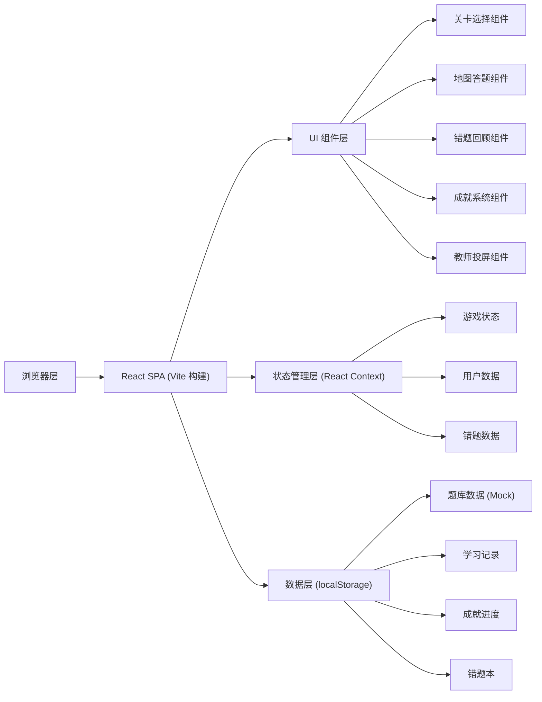

# 地理学习小游戏 技术架构文档

## 1. 架构设计

本项目为纯前端单页应用（SPA），不依赖后端服务。所有数据存储在浏览器 localStorage 中，地图使用 SVG 实现互动效果。



## 2. 技术选型说明

- **前端框架**：React@18 + TypeScript
- **构建工具**：Vite@5
- **样式方案**：TailwindCSS@3 + CSS Modules 补充
- **路由管理**：React Router DOM@6
- **状态管理**：React Context + useReducer
- **图标库**：Lucide React
- **动画方案**：CSS Animations + Framer Motion
- **数据持久化**：localStorage
- **地图实现**：SVG + 内联交互逻辑

## 3. 目录结构

```
src/
├── components/          # 通用组件
│   ├── Button/          # 按钮组件
│   ├── Card/            # 卡片组件
│   ├── Modal/           # 弹窗组件
│   └── ProgressBar/     # 进度条组件
├── pages/               # 页面组件
│   ├── HomePage/        # 首页/关卡选择
│   ├── GamePage/        # 答题页
│   ├── ReviewPage/      # 错题回顾页
│   ├── AchievementsPage/# 成就页
│   └── TeacherPage/     # 教师投屏页
├── maps/                # SVG 地图组件
│   ├── ChinaMap.tsx     # 中国地图
│   ├── WorldMap.tsx     # 世界大洲图
│   ├── GridMap.tsx      # 经纬度网格图
│   └── CampusMap.tsx    # 校园平面图
├── data/                # 题库数据
│   ├── china.ts         # 中国地图题目
│   ├── world.ts         # 世界地图题目
│   ├── grid.ts          # 经纬度题目
│   └── campus.ts        # 校园平面图题目
├── context/             # 状态管理
│   ├── GameContext.tsx  # 游戏状态
│   └── UserContext.tsx  # 用户数据
├── hooks/               # 自定义 hooks
│   ├── useTimer.ts      # 倒计时 hook
│   └── useLocalStorage.ts # 本地存储 hook
├── types/               # TypeScript 类型定义
├── utils/               # 工具函数
├── App.tsx
├── main.tsx
└── index.css
```

## 4. 路由定义

| 路由路径 | 页面名称 | 功能说明 |
|----------|----------|----------|
| `/` | 首页/关卡选择 | 选择地图类型、难度，开始游戏 |
| `/game/:mapType` | 答题页 | 核心答题交互界面 |
| `/review` | 错题回顾页 | 查看和复习错题 |
| `/achievements` | 成就页 | 查看成就徽章和学习统计 |
| `/teacher` | 教师模式页 | 投屏模式、随机抽题 |

## 5. 数据模型

### 5.1 题目数据模型

```typescript
interface Question {
  id: string;
  mapType: 'china' | 'world' | 'grid' | 'campus';
  difficulty: 'easy' | 'medium' | 'hard';
  type: 'province' | 'city' | 'river' | 'direction' | 'continent' | 'latitude' | 'longitude' | 'building';
  targetId: string;        // 地图上对应区域的 ID
  prompt: string;          // 题目提示文字
  explanation: string;     // 答案解释
  hints: string[];         // 提示列表（3级）
}
```

### 5.2 用户数据模型

```typescript
interface UserData {
  totalQuestions: number;      // 总答题数
  correctAnswers: number;      // 正确答题数
  totalTime: number;           // 总答题时间（秒）
  streakDays: number;          // 连续练习天数
  lastPlayDate: string;        // 最后练习日期
  bestStreak: number;          // 最佳连对记录
  achievements: string[];      // 已解锁成就 ID 列表
  playHistory: PlayRecord[];   // 游戏历史记录
}

interface PlayRecord {
  date: string;
  mapType: string;
  difficulty: string;
  score: number;
  correctCount: number;
  totalCount: number;
  avgTime: number;
}
```

### 5.3 错题数据模型

```typescript
interface WrongQuestion {
  id: string;
  questionId: string;
  question: Question;
  wrongAnswer: string;     // 错误选择的区域 ID
  wrongPosition?: { x: number; y: number }; // 点击位置
  timestamp: number;
  reviewed: boolean;       // 是否已复习
}
```

### 5.4 成就数据模型

```typescript
interface Achievement {
  id: string;
  name: string;
  description: string;
  icon: string;             // emoji 图标
  category: 'speed' | 'accuracy' | 'streak' | 'collection';
  condition: {
    type: 'correct_count' | 'accuracy_rate' | 'avg_time' | 'streak_days' | 'map_complete';
    value: number;
    mapType?: string;
  };
  points: number;
}
```

## 6. 核心功能实现方案

### 6.1 SVG 地图交互

- 使用内联 SVG 定义地图各区域（省份、大洲、网格等）
- 每个可点击区域设置唯一 ID，与题库关联
- 通过 CSS 控制 hover 高亮和选中状态
- 点击事件触发答题判断

### 6.2 倒计时系统

- 自定义 useTimer hook 管理倒计时
- 不同难度对应不同时间：简单60秒/中等45秒/困难30秒
- 时间不足时视觉警告（颜色变红、闪烁）

### 6.3 连对奖励机制

- 连续答对累加 streak 值
- 到达 3/5/10 时触发奖励动画和额外加分
- 答错重置 streak

### 6.4 三级提示系统

- 第1次提示：缩小范围（如"在中国北方"）
- 第2次提示：显示相关特征（如"省会是西安"）
- 第3次提示：显示首字/轮廓高亮

### 6.5 成就检测

- 每次答题后检测是否达成新成就
- 基于用户数据的各项指标判断
- 解锁成就时弹出庆祝动画

### 6.6 教师投屏模式

- 全屏模式优化布局
- 答案显示开关
- 随机抽题功能
- 地图缩放控制
- 大字号和高对比度设计

## 7. 性能优化

- SVG 地图优化：简化路径、合并相似元素
- 懒加载：各页面组件按需加载
- 动画优化：使用 CSS transform 和 opacity
- 数据缓存：题库数据一次性加载
- 避免重排：答题反馈使用绝对定位浮层
